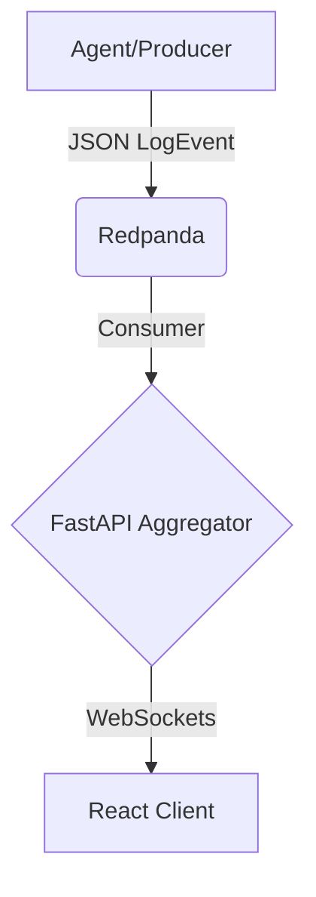

# 🏙️ Log-Metropolis: A visualizer for Infrastructure

> **"Situational Awareness over Exact Precision."**

Log-Metropolis is a real-time 3D visualization tool that maps observability metrics to a living city.
- **Buildings** = Microservices (Height scales with CPU/Load).
- **Traffic** = HTTP Requests (Particles).
- **Errors** = Fire/Smoke.

## 🏗️ Architecture
We utilize a high-throughput, one-way data pipeline:



## 🛠️ Tech Stack
Backend: Python (FastAPI) + AsyncIO

Broker: Redpanda (Kafka-compatible)

Frontend: React + React Three Fiber (InstancedMesh)

Infra: Docker Compose

## 🚀 Phase Status

[x] Phase 1: The Nervous System (Pipeline: Producer -> Redpanda -> Consumer)

[x] Phase 2: The Heartbeat (Aggregation & WebSockets)

[ ] Phase 3: The City (R3F Visualization)

## ⚡ Quick Start (Phase 1)
Start Infrastructure:

```Bash
cd infra
docker-compose up -d
```

Start Backend (Consumer):

```Bash
cd backend
uvicorn app.main:app --reload
```

Run Mock Agent (Producer):

```Bash
python agent/mock_producer.py
```
